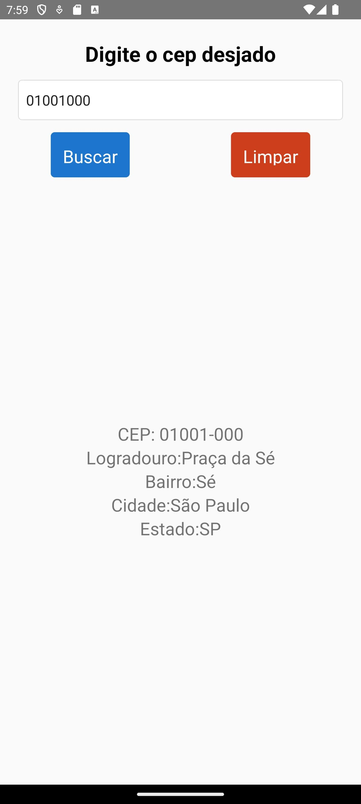

# Aplicativo Busca CEP

Aplicativo desenvolvido em React Native para buscar informações de endereço através do CEP utilizando a API pública do ViaCEP.

### Funcionalidades

- **Buscar CEP**: Permite ao usuário inserir um CEP válido para consultar as informações de endereço.
- **Limpar**: Limpa o campo de entrada e os resultados da busca.
- **Exibição de Resultados**: Apresenta as informações do endereço (logradouro, bairro, cidade e estado) quando o CEP é encontrado.

### Como usar

1. **Digite o CEP desejado**: Insira o CEP desejado no campo de entrada.
2. **Buscar**: Pressione o botão "Buscar" para iniciar a consulta.
3. **Limpar**: Para limpar o campo e os resultados, pressione o botão "Limpar".

### Instruções de Instalação

1. Clone o repositório:

   ```bash
   git clone https://github.com/leandrovelosos/AppBuscaCep.git

2. Instale o axios: 
    ```bash
    npm install axios
    
3. Execute o projeto: 
    ```bash
    npx react-native run-android

## Tela do app

 